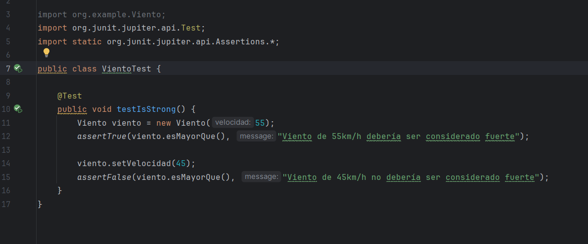

## Primer Sprint: Estrategia de validación de pruebas, stubs y fakes (8 puntos)
## Objetivos
- Desarrollo inicial del sistema: Crear el sistema con un diseño limpio y clases con
responsabilidad única.
- Implementación de TDD: Utilizar el desarrollo dirigido por pruebas (TDD) para asegurar que
cada componente cumpla con su responsabilidad.
- Estrategia de validación de pruebas: Definir y aplicar una estrategia de validación que
incluya stubs y fakes para simular las condiciones climáticas externas.
- Refactorización y código limpio: Asegurar que el código sea limpio y fácil de mantener
mediante la refactorización continua.
- Métricas de calidad: Establecer métricas de calidad para evaluar la cobertura de pruebas y la
complejidad del código.

## Actividades del Sprint 1
### 1. Diseño y implementación inicial:
o Diseñar las clases responsables de manejar las condiciones climáticas (Temperatura,
Lluvia, Viento).
o Implementar estas clases asegurando que cada una tenga una única
responsabilidad.

Las clases se desarrollan de manera parecid, cada clase (Temperatura, Lluvia, Viento) tiene un atributo para su valor, métodos para obtener y establecer dicho valor, y un método para verificar si supera un umbral.

`ClaseTemperatura`

`Clase Lluvia`

`Clase Viento`

Dado que nos pide una salida:

Modificare los umbrales y agregare una clase main para probar los valores:

Tambien implemente una clase main sencilla para probar la salida, por ahora creare instancias de las condiciones climáticas con valores específicos de la siguiente manera (en el sprint 2 implementare la funcionabilidad para que el usuario digite por consola):

Y la salida:

### 2. Desarrollo con TDD:
o Escribir pruebas unitarias para cada clase antes de implementar la funcionalidad.
o Implementar la funcionalidad necesaria para que las pruebas pasen.
o Refactorizar el código después de que las pruebas pasen para mantenerlo limpio.

`TemperaturaTest`

`LluviaTest`

`VientoTest`

Como los test implementados son similares, explicare de manera general:

El test LluviaTest, VientoTest, TemperaturaTets verifican el comportamiento del método esMayorQue en la clase respectiva. El método debería devolver true cuando la cantidad de lluvia,vuento o temperatura es intensa (mayor a un umbral) y false en caso contrario.

Por ejemplo para Lluvia, primero, se crea una instancia de Lluvia con 25mm y se verifica que esMayorQue devuelva true, ya que 25mm es considerado intenso.
Luego, se cambia la cantidad de lluvia a 15mm y se verifica que esMayorQue devuelva false, ya que 15mm no es considerado intenso.
Estas verificaciones aseguran que el método esMayorQue funcione correctamente para diferentes cantidades de lluvia.

- Para la refactorizacion me aseguro de que los métodos tengan nombres claros y significativos.
- Tambien Verifique que no haya código duplicado.
- Revise que las clases no tengan responsabilidades múltiples.
En este caso, el código es bastante simple y sigue los principios de diseño limpio, por lo que no hay mucho que refactorizar. Las clases Temperatura, Lluvia, y Viento tienen una única responsabilidad y los métodos son claros y concisos.

### 3. Validación de pruebas con stubs y fakes:
o Crear stubs para simular las condiciones climáticas
o Implementar fakes para simular escenarios de prueba más complejos

Ya que los stubs son objetos simples que simulan las respuestas de componentes dependientes, voy a crear stubs para simular las condiciones climáticas de temperatura, lluvia y viento.

He creado stubs para las condiciones climáticas (Temperatura, Lluvia, Viento) que simulan comportamientos específicos.

Ahora implementare un Fake para simular las condiciones climaticas:

He implementado un fake para CondicionesClimaticas que combina múltiples condiciones climáticas y verifica las alertas correspondientes.

Ahora escribire una prueba unitaria que utiliza el fake para verificar que las salidas esperadas se generan correctamente según las condiciones climáticas simuladas.

El test CondicionesClimaticasFakeTest verifica la salida de las alertas cuando se cumplen ciertas condiciones climáticas.

- Captura la salida de la consola usando ByteArrayOutputStream.
- Crea una instancia de CondicionesClimaticasFake con condiciones específicas (35°C, 25mm de lluvia, 55km/h de viento).
- Llama al método verificarCondiciones para generar las alertas.
- Compara la salida capturada con la salida esperada ("Alerta: Temperatura Alta!\nAlerta: Lluvia Intensa!\nAlerta: Viento Fuerte!\n") para asegurarse de que las alertas se generen correctamente.

### 4. Refactorización y código limpio:
o Refactorizar el código regularmente para mejorar la legibilidad y mantenibilidad.
o Aplicar principios de diseño limpio y patrones de diseño adecuados.

### 5. Métricas de calidad:
o Utilizar herramientas para medir la cobertura de pruebas (Jacoco)
o Evaluar la complejidad del código utilizando métricas como la complejidad
ciclomática.

Para usar jacoco agrego las dependencias:

y ejecuto con el comando `./gradlew jacocoTestReport`

