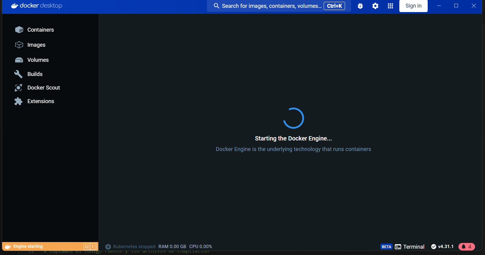
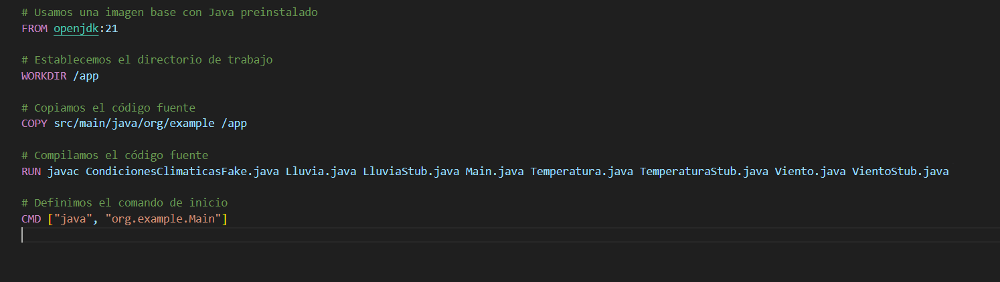
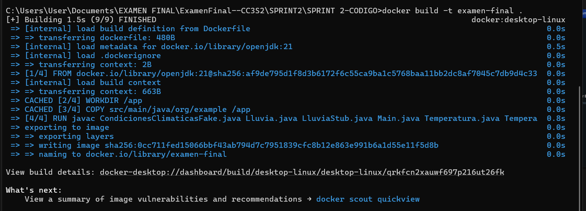
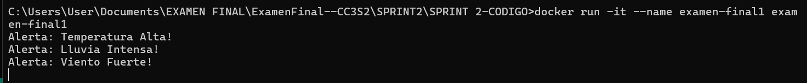
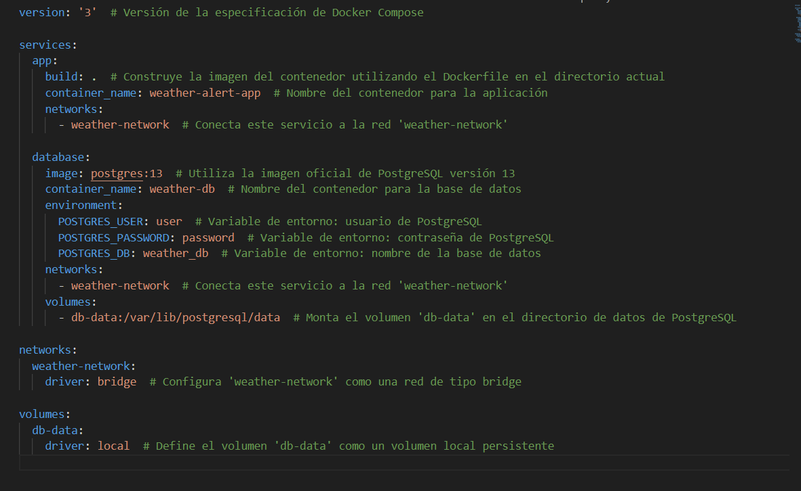
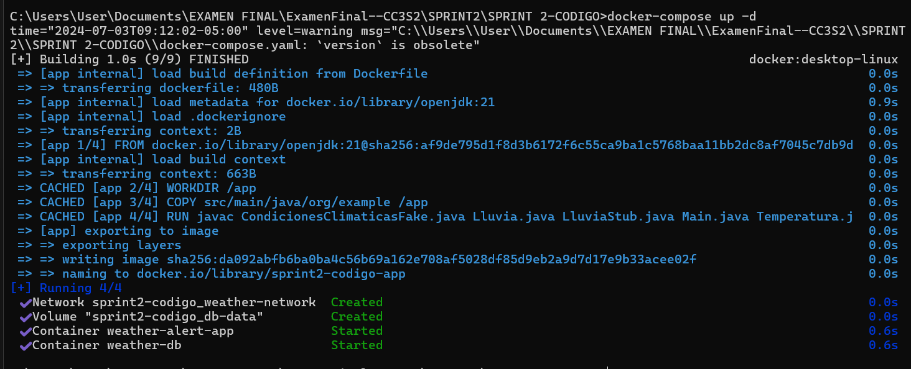
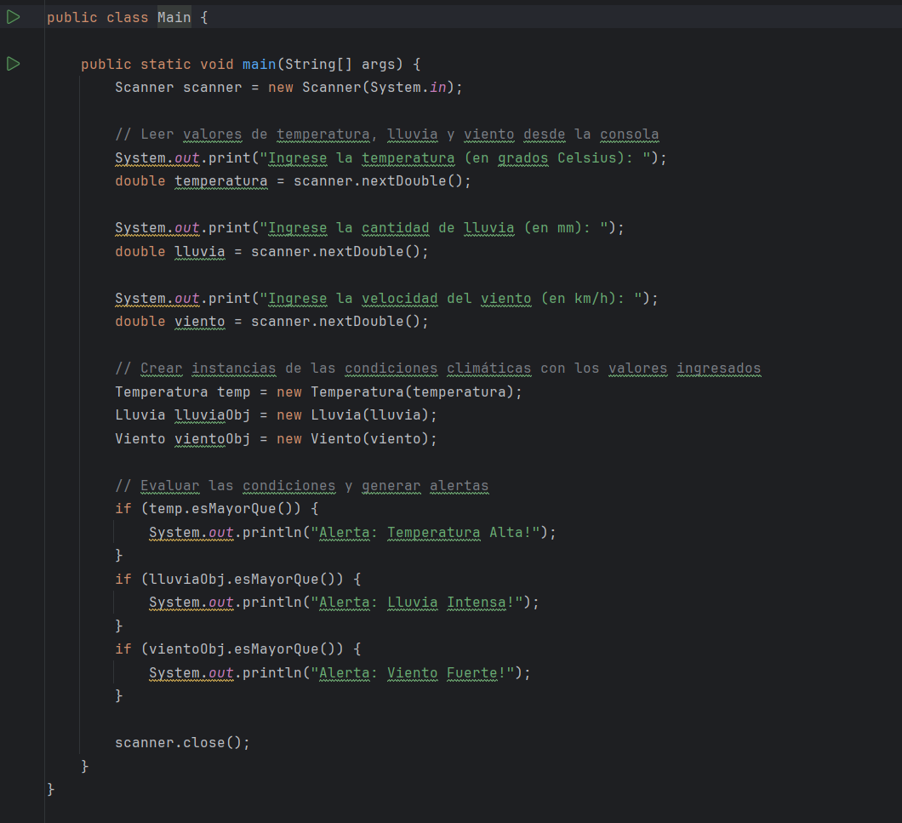
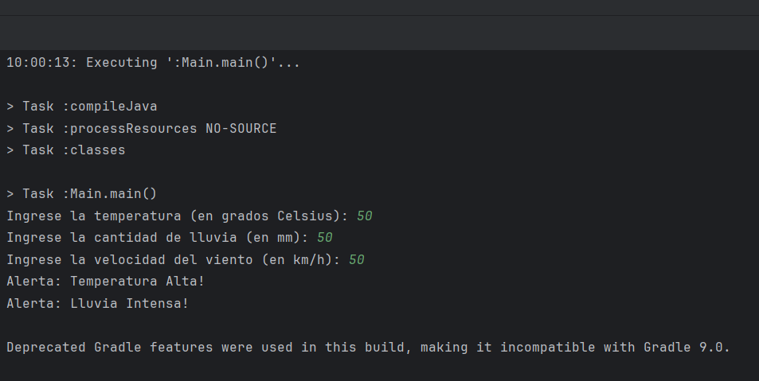
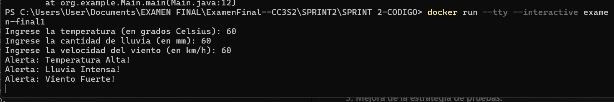

# Segundo Sprint: Uso de docker y mejora de la estrategia de pruebas (12 puntos)
## Objetivos
- Contenerización del sistema: Utilizar Docker para contenerizar la aplicación y asegurar su
portabilidad.
- Refinamiento del tDD: Continuar utilizando TDD para cualquier nueva funcionalidad o
mejora.
- Mejora de la estrategia de pruebas: Integrar la estrategia de pruebas en un entorno
Dockerizado.
- Refactorización y código limpio: Continuar refactorizando el código para mantener su
calidad.
- Métricas de calidad: Continuar monitoreando y mejorando las métricas de calidad del
código.

Actividades

### 1. Contenerización del Sistema:
o Crear un Dockerfile para construir la imagen de la aplicación.

Inicializo el docker

Escribo el Dockerfile y lo pongo a nivel del proyecto.

Para el Run usare javac y no gradlew, la verdad no he probado aun con el gradlew.

Usare el comando `docker build -t examen-final .`

Usare un contenedor para probar que la imagen se ha construido de manera adecuada y reconoce todas mis clases, para ello uso el comando: `docker run -it --name examen-final examen-final`

No hay errores, pues la compilacion es correcta, significa que las pruebas implementadas hasta el sprint 1 son correctas, esto sera mi referente para las futuras implmentaciones.

Configurar un docker-compose.yml si se necesitan múltiples servicios (bases de datos, servicios de simulación de clima).

Para database utilizare la imagen oficial de PostgreSQL versión 13 (postgres:13) ya que he hecho algunso trabajos antes aca,se configura las variables de entorno (POSTGRES_USER, POSTGRES_PASSWORD, POSTGRES_DB) necesarias para inicializar la base de datos PostgreSQL. También se conecta a la red weather-network y monta el volumen db-data en el directorio de datos de PostgreSQL para persistencia de datos.

Utilizo el comando `docker-compose up -d`

### 2. Refinamiento del TDD:
o Escribir nuevas pruebas para cualquier funcionalidad adicional.

o Asegurar que todas las pruebas existentes pasen en el entorno Dockerizado.

Como ya lo mencione en el entorno todo esta correcto.

Agregare algunas mejoras al codigo que se hizo en el sprint 1, en la clase Main hice una pequeña modificacion, para que el usuario sea el que interactue con la consola y pueda dar valores de lluvia, temperatura y viento:

Son cambios simples pero igual los comento:

- Se utiliza Scanner para leer los valores de temperatura, lluvia y viento directamente desde la consola.
- Cada valor se imprime con un mensaje indicando qué se espera que ingrese el usuario.
- Después de leer los valores, se crean las instancias correspondientes de Temperatura, Lluvia y Viento.
- Luego se evalúan estas instancias para determinar si se deben generar alertas según las condiciones climáticas ingresadas.

Y la ejecucion:

Para verlo en el contenedor simplemente actualizo la imagen "examen-final" con un build y luego ejecuto con un run, sin embargo hay una variacion para poder interactuar con la consola despues de correr el contenedor se usa el commando : `docker run --tty --interactive examen-final1`:

y vemos que compila correctamente.

### 3. Mejora de la estrategia de pruebas:
o Integrar las pruebas unitarias y de integración en el pipeline de Docker.
o Asegurar que los stubs y fakes funcionen correctamente en el entorno
contenerizado.
### 4. Refactorización y código limpio:
o Continuar refactorizando el código para mejorar la calidad y mantener la adherencia
a los principios de diseño limpio.
### 5. Métricas de Calidad:
o Monitorear la cobertura de pruebas y la complejidad del código en el entorno
Dockerizado.
o Utilizar herramientas de análisis de código para asegurar la calidad

