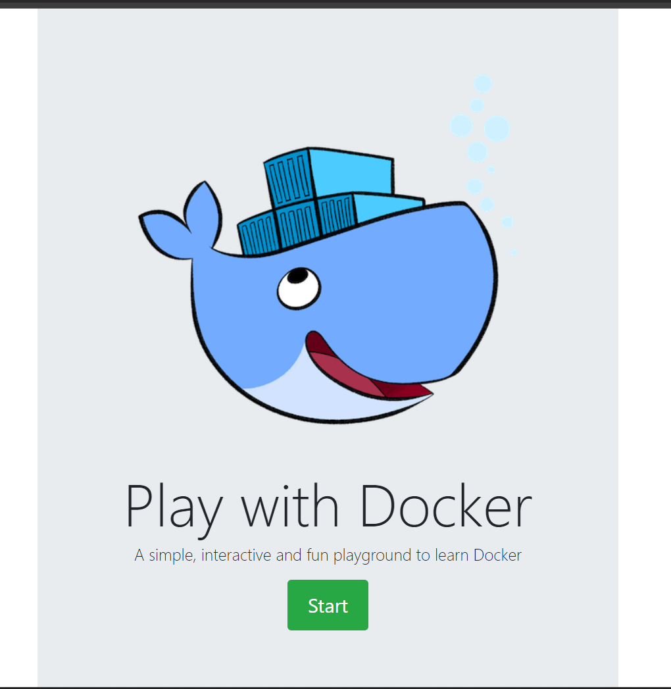
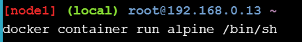
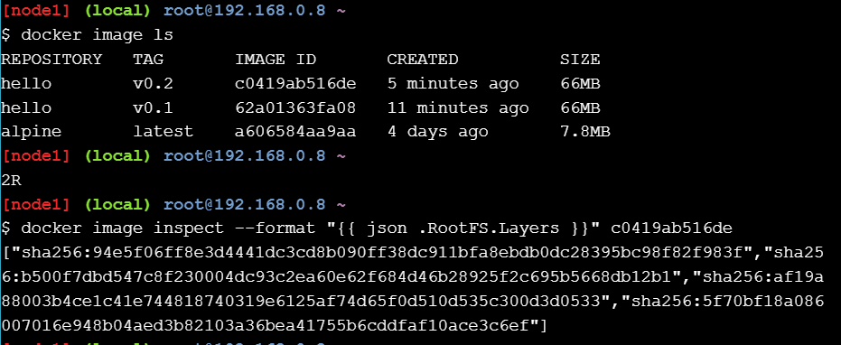

# ACTIVIDAD PLAY WITH DOCKER

## Docker for IT Pros and System Administrators
## Stage 1

### Objetivos:

- Familiarizarse con los conceptos centrales de Docker

- Ayudarle a comprender por qué otros líderes de TI están adoptando rápidamente Docker

- Ayudarle a ver cómo Docker puede ayudar a su organización

### Laboratorios a realizar:

- `Sus primeros contenedores de Linux`: en esta práctica de laboratorio explorará los conceptos básicos de la ejecución de contenedores: extraer imágenes de un registro, ejecutar una aplicación en contenedores e instancias y aislamiento de contenedores.

- `Personalización de imágenes de Docker`: continúe creando sus propias imágenes de Docker personalizadas y explore el concepto de capas de imágenes de Docker y el Dockerfile.

- `Implementar y administrar múltiples contenedore`s: las aplicaciones reales constan de múltiples componentes. En esta práctica de laboratorio, comenzará a explorar la ejecución de múltiples servicios como una sola pila con Docker Swarm.

Lo primero es loguearse con un correo en la pagina Play with Dockers:

### 1.0 Ejecutando tu primer contenedor

¡Es hora de ensuciarnos las manos! Como ocurre con todo lo técnico, una aplicación de “hola mundo” es un buen punto de partida. Escribiremos el código siguiente para ejecutar nuestro primer contenedor Docker:

### 1.1 Docker Images

En el resto de esta práctica de laboratorio, ejecutaremos un contenedor Alpine Linux . Alpine es una distribución de Linux liviana, por lo que es rápida de instalar y ejecutar, lo que la convierte en un punto de partida popular para muchas otras imágenes.

Para comenzar, ejecutemos lo siguiente en nuestra terminal:

El comando pull recupera la imagen alpine del registro de Docker y la guarda en nuestro sistema. En este caso el registro es Docker Hub.

Podemos utilizar el comando Docker Image para ver una lista de todas las imágenes de nuestro sistema.

![alt text]images/image-4.png)

## 1.1 Docker Container Run

¡Excelente! Ahora ejecutemos un contenedor Docker basado en esta imagen. Para hacer eso, utilizaremos el comando de ejecución del contenedor Docker.

Si bien el resultado del comando ls puede no ser tan emocionante, detrás de escena sucedieron bastantes cosas. Cuando llama a ejecutar, el cliente Docker encuentra la imagen (alpine en este caso), crea el contenedor y luego ejecuta un comando en ese contenedor. Cuando ejecuta Docker Container Run Alpine, proporciona un comando (ls -l), por lo que Docker ejecuta este comando dentro del contenedor para el cual vio la lista de directorios. Una vez finalizado el comando ls, el contenedor se cerró.

El hecho de que el contenedor haya salido después de ejecutar nuestro comando es importante, como empezaremos a ver. Probemos algo más emocionante. Escribamos lo siguiente:

En este caso, el cliente Docker ejecutó diligentemente el comando echo dentro de nuestro contenedor alpino y luego salió. Todo eso sucedió bastante rápido y nuevamente nuestro contenedor salió. Como verá en unos pocos pasos más, el comando echo se ejecutó en una instancia de contenedor separada. Imagine iniciar una máquina virtual (VM), ejecutar un comando y luego eliminarlo; Tomaría uno o dos minutos iniciar la VM antes de ejecutar el comando. Una máquina virtual tiene que emular una pila de hardware completa, iniciar un sistema operativo y luego iniciar su aplicación; es un entorno de hardware virtualizado. Los contenedores Docker funcionan en la capa de aplicación, por lo que omiten la mayoría de los pasos que requieren las máquinas virtuales y simplemente ejecutan lo que se requiere para la aplicación. ¡Ahora ya sabes por qué dicen que los contenedores son rápidos!

Intentemos otro comando:

Espera, ¡no pasó nada! ¿Es eso un error? ¡No! De hecho, algo sucedió. Inició una tercera instancia del contenedor alpino, ejecutó el comando /bin/shy luego salió. No proporcionó ningún comando adicional, por /bin/shlo que simplemente inició el shell, salió del shell y luego detuvo el contenedor. Lo que cabría esperar era un shell interactivo donde se pudieran escribir algunos comandos. Docker tiene una función para esto agregando una bandera para ejecutar el contenedor en una terminal interactiva. Para este ejemplo, escribamos lo siguiente:

Ahora estamos dentro del contenedor ejecutando un shell de Linux y podemos probar algunos comandos como ls -ly uname -aotros. Recordemos que Alpine es un sistema operativo Linux pequeño, por lo que es posible que falten varios comandos. Salimos del shell y del contenedor escribiendo el "exit" comando.

Bien, dijimos que habíamos ejecutado cada uno de nuestros comandos anteriores en una instancia de contenedor separada. Podemos ver estas instancias usando el docker container lscomando. El docker container lscomando por sí solo le muestra todos los contenedores que se están ejecutando actualmente:

Como no hay ningún contenedor en ejecución, veremos una línea en blanco. Probemos una variante más útil: `docker container ls -a`

Lo que se ve ahora es una lista de todos los contenedores que ejecutamos. Observe que la columna ESTADO muestra que estos contenedores salieron hace algún tiempo.

Aquí se muestra el mismo resultado del comando ls -a del contenedor acoplable, mostrado en forma de diagrama:

## 1.2 Aislamiento de contenedores

En los pasos anteriores ejecutamos varios comandos a través de instancias de contenedor con la ayuda de Docker Container Run. El comando docker container ls -a nos mostró que había varios contenedores enumerados. ¿Por qué aparecen tantos contenedores si todos son de la imagen alpina?

¡Este es un concepto de seguridad crítico en el mundo de los contenedores Docker! Aunque cada comando de ejecución del contenedor Docker utilizó la misma imagen alpina, cada ejecución fue un contenedor separado y aislado. Cada contenedor tiene un sistema de archivos independiente y se ejecuta en un espacio de nombres diferente; De forma predeterminada, un contenedor no tiene forma de interactuar con otros contenedores, ni siquiera con aquellos de la misma imagen. Intentemos otro ejercicio para aprender más sobre el aislamiento.

El /bin/ash es otro tipo de caparazón disponible en la imagen alphine. Una vez que se inicie el contenedor y esté en el símbolo del sistema del contenedor, escriba los siguientes comandos:

El primer comando echo crea un archivo llamado "hello.txt" con las palabras "hello world" dentro. El segundo comando le brinda una lista de directorios de los archivos y debería mostrar el archivo “hello.txt” recién creado. Ahora escribe exit para salir de este contenedor.

Para mostrar cómo funciona el aislamiento, ejecute lo siguiente:

Es el mismo comando ls que usamos dentro del shell ash interactivo del contenedor, pero esta vez, ¿notaste que falta el archivo “hello.txt”? ¡Eso es aislamiento! Su comando se ejecutó en una instancia nueva e independiente, aunque esté basada en la misma imagen. La segunda instancia no tiene forma de interactuar con la primera instancia porque Docker Engine las mantiene separadas y no hemos configurado ningún parámetro adicional que permita que estas dos instancias interactúen.

En el trabajo diario, los usuarios de Docker aprovechan esta característica no solo por motivos de seguridad, sino también para probar los efectos de realizar cambios en la aplicación. El aislamiento permite a los usuarios crear rápidamente copias de prueba separadas y aisladas de una aplicación o servicio y ejecutarlas en paralelo sin interferir entre sí. De hecho, existe un ciclo de vida completo en el que los usuarios toman sus cambios y los trasladan a producción utilizando este concepto básico y las capacidades integradas de Docker Enteprise. Exploraremos más de eso en ejercicios posteriores.

En este momento, la pregunta obvia es "¿cómo vuelvo al contenedor que tiene mi archivo 'hello.txt'?"

Una vez más ejecutemos el:

Gráficamente esto es lo que pasó en nuestro Docker Engine:

El contenedor en el que creamos el archivo “hello.txt” es el mismo donde usamos el shell /bin/ash, que podemos ver listado en la columna “COMMAND”. El número de ID del contenedor de la primera columna identifica de forma única esa instancia de contenedor en particular. En el resultado de ejemplo anterior, el ID del contenedor es `ebf2bfd9e784`. Podemos usar un comando ligeramente diferente para indicarle a Docker que ejecute esta instancia de contenedor específica. Intente escribir:

Ahora usemod el comando docker container ls nuevamente para enumerar los contenedores en ejecución.

Observemos esta vez que nuestra instancia de contenedor todavía se está ejecutando. Usamos el shell ash esta vez, por lo que en lugar de simplemente salir como lo hizo /bin/sh antes, ash espera un comando. Podemos enviar un comando al contenedor para ejecutarlo usando el comando exec, de la siguiente manera:

Esta vez obtenemos una lista de directorios y muestra nuestro archivo "hello.txt" porque usamos la instancia del contenedor donde creamos ese archivo.

## 2 Hacer más con imágenes de Docker

## 2.0 Image creation from a container

Comencemos ejecutando un shell interactivo en un contenedor de ubuntu:

Como sabe de laboratorios anteriores, acaba de tomar la imagen llamada “ubuntu” de Docker Store y ahora está ejecutando el shell bash dentro de ese contenedor.1

Para personalizar un poco las cosas, instalaremos un paquete llamado figlet en este contenedor. Su contenedor aún debería estar ejecutándose, así que escriba los siguientes comandos en la línea de comando de su contenedor ubuntu:

Deberías ver las palabras "hola docker" impresas en caracteres ascii grandes en la pantalla. Adelante, sal de este contenedor.

Ahora supongamos que esta nueva aplicación Figlet es bastante útil y desea compartirla con el resto de su equipo. Podrías decirles que hagan exactamente lo que hiciste arriba e instalen figlet en su propio contenedor, lo cual es bastante simple en este ejemplo. Pero si se tratara de una aplicación del mundo real en la que acaba de instalar varios paquetes y ejecutar una serie de pasos de configuración, el proceso podría volverse engorroso y bastante propenso a errores. En cambio, sería más fácil crear una imagen que puedas compartir con tu equipo.

Para comenzar, necesitamos obtener el ID de este contenedor usando el comando ls (no olvide la opción -a ya que el comando ls no devuelve los contenedores que no se están ejecutando).

Antes de crear nuestra propia imagen, es posible que deseemos inspeccionar todos los cambios que realizamos. Intente escribir el comando docker container diff "container ID" para el contenedor que acaba de crear. Debería ver una lista de todos los archivos que se agregaron o cambiaron en el contenedor cuando instaló figlet. Docker realiza un seguimiento de toda esta información por nosotros. Esto es parte del concepto de capa que exploraremos en unos minutos.

Ahora, para crear una imagen necesitamos "confirmar" este contenedor. La confirmación crea una imagen localmente en el sistema que ejecuta el motor Docker. Ejecute el siguiente comando, utilizando la ID del contenedor que recuperó, para confirmar el contenedor y crear una imagen a partir de él.

Eso es todo: ¡has creado tu primera imagen! Una vez confirmada, podremos ver la imagen recién creada en la lista de imágenes disponibles.

Tenga en cuenta que la imagen que bajamos en el primer paso (ubuntu) aparece aquí junto con nuestra propia imagen personalizada. Excepto que nuestra imagen personalizada no tiene información en las columnas REPOSITORIO o ETIQUETA, lo que haría difícil identificar exactamente qué hay en este contenedor si quisiéramos compartirlo entre varios miembros del equipo.

Agregar esta información a una imagen se conoce como etiquetar una imagen. Del comando anterior, obtenga el ID de la imagen recién creada y etiquétela para que se llame ourfiglet:

Ahora tenemos el nombre más amigable "ourfiglet" que podemos usar para identificar nuestra imagen.

Graficamente esto es lo que paso:

Ahora ejecutaremos un contenedor basado en la imagen de ourfiglet recién creada:

Este ejemplo muestra que podemos crear un contenedor, agregar todas las bibliotecas y binarios que contiene y luego confirmarlo para crear una imagen. Luego podemos usar esa imagen tal como lo haríamos con las imágenes extraídas de Docker Store. Todavía tenemos un pequeño problema porque nuestra imagen solo se almacena localmente. Para compartir la imagen, nos gustaría enviarla a un registro en algún lugar. Esto está más allá del alcance de esta práctica de laboratorio (y no debe ingresar ninguna información de inicio de sesión personal en estas prácticas de laboratorio), pero puede obtener una ID de Docker gratuita, ejecutar estas prácticas de laboratorio y acceder a Docker Community Hub desde su propio sistema usando Docker para Windows. o Docker para Mac si quieres probar esto.

Como se mencionó anteriormente, este enfoque de instalar software manualmente en un contenedor y luego enviarlo a una imagen personalizada es solo una forma de crear una imagen. Funciona bien y es bastante común. Sin embargo, existe una forma más poderosa de crear imágenes. En el siguiente ejercicio veremos cómo se crean imágenes usando un Dockerfile, que es un archivo de texto que contiene todas las instrucciones para construir una imagen.

## 2.1 Creación de imágenes usando un Dockerfile

En lugar de crear una imagen binaria estática, podemos usar un archivo llamado Dockerfile para crear una imagen. El resultado final es esencialmente el mismo, pero con un Dockerfile proporcionamos las instrucciones para crear la imagen, en lugar de solo los archivos binarios sin formato. Esto es útil porque resulta mucho más fácil gestionar los cambios, especialmente a medida que las imágenes se vuelven más grandes y complejas.

Por ejemplo, si se lanza una nueva versión de figlet, tendríamos que volver a crear nuestra imagen desde cero o ejecutar nuestra imagen y actualizar la versión instalada de figlet. Por el contrario, un Dockerfile incluiría los comandos apt-get que usamos para instalar figlet de modo que nosotros, o cualquiera que use el Dockerfile, podamos simplemente recomponer la imagen usando esas instrucciones.

Ok, tal vez sea un poco exagerado, pero los Dockerfiles son poderosos porque nos permiten administrar cómo se construye una imagen, en lugar de solo administrar archivos binarios. En la práctica, los Dockerfiles se pueden administrar de la misma manera que se administra el código fuente: son simplemente archivos de texto, por lo que se puede usar casi cualquier sistema de control de versiones para administrar los Dockerfiles a lo largo del tiempo.

Usaremos un ejemplo simple en esta sección y crearemos una aplicación de "hola mundo" en Node.js. No se preocupe si no está familiarizado con Node.js: Docker (y este ejercicio) no requiere que conozca todos estos detalles.

Comenzaremos creando un archivo en el que recuperamos el nombre de host y lo mostramos. NOTA: Deberías estar en la línea de comando del host de Docker ($). Si ve una línea de comando similar a root@abcd1234567:/# entonces probablemente todavía esté dentro de su contenedor ubuntu del ejercicio anterior. Escriba salir para volver a la línea de comando del host.

y creamos el dockerfile:

Construyamos nuestra primera imagen a partir de este Dockerfile y le llamaremos hola:v0.1:

Esto es lo que acabas de completar:

Luego iniciamos un contenedor para comprobar que nuestras aplicaciones se ejecutan correctamente:

¿Lo que acaba de suceder? Creamos dos archivos: el código de nuestra aplicación (index.js) es un simple fragmento de código javascript que imprime un mensaje. Y el Dockerfile son las instrucciones para que el motor Docker cree nuestro contenedor personalizado. Este Dockerfile hace lo siguiente:

1. Especifica una imagen base de la que extraer: la imagen alpina que utilizamos en laboratorios anteriores.
2. Luego EJECUTA dos comandos (actualización de apk y adición de apk) dentro de ese contenedor que instala el servidor Node.js.
3. Luego le dijimos que COPIARA archivos de nuestro directorio de trabajo al contenedor. El único archivo que tenemos ahora es nuestro index.js.
4. A continuación especificamos WORKDIR: el directorio que el contenedor debe usar cuando se inicia.
5. Y finalmente, le dimos a nuestro contenedor un comando (CMD) para que se ejecute cuando se inicie el contenedor.

Recuerde que en laboratorios anteriores pusimos comandos como echo "hello world" en la línea de comando. Con un Dockerfile podemos especificar comandos precisos para ejecutar para todos los que usan este contenedor. Otros usuarios no tienen que construir el contenedor ellos mismos una vez que lo subes a un repositorio (que cubriremos más adelante) o incluso saber qué comandos se utilizan. El Dockerfile nos permite especificar cómo construir un contenedor para que podamos repetir esos pasos con precisión cada vez y podamos especificar qué debe hacer el contenedor cuando se ejecuta. En realidad, existen varios métodos para especificar los comandos y aceptar los parámetros que utilizará un contenedor, pero por ahora basta con saber que tiene las herramientas para crear algunos contenedores bastante potentes.|

## 2.2 Image layers

Hay algo más interesante en las imágenes que creamos con Docker. Cuando se ejecutan, parecen ser un único sistema operativo y aplicación. Pero las imágenes en sí están construidas en capas. Si se desplaza hacia atrás y observa el resultado del comando de creación de imágenes de la ventana acoplable, notará que había 5 pasos y que cada paso tenía varias tareas. Debería ver varias tareas de “buscar” y “extraer” en las que Docker toma varios bits de Docker Store u otros lugares. Estos bits se utilizaron para crear una o más capas de contenedores. Las capas son un concepto importante. Para explorar esto, realizaremos otra serie de ejercicios.

Primero, revise la imagen que creó anteriormente usando el comando historial (recuerde usar el comando docker image ls de ejercicios anteriores para encontrar las ID de sus imágenes):

Lo que ve es la lista de imágenes de contenedores intermedios que se crearon a lo largo del camino hacia la creación de la imagen final de su aplicación Node.js. Algunas de estas imágenes intermedias se convertirán en capas en la imagen contenedora final. En la salida del comando de historial, las capas Alpine originales están al final de la lista y luego cada personalización que agregamos en nuestro Dockerfile es su propio paso en la salida. Este es un concepto poderoso porque significa que si necesitamos hacer un cambio en nuestra aplicación, ¡es posible que solo afecte a una sola capa! Para ver esto, modificaremos un poco nuestra aplicación y crearemos una nueva imagen.

Escriba lo siguiente en la ventana de su consola:

Esto agregará una nueva línea al final de su archivo index.js anterior para que su aplicación genere una línea adicional de texto. Ahora crearemos una nueva imagen usando nuestro código actualizado. También etiquetaremos nuestra nueva imagen para marcarla como una nueva versión, de modo que cualquiera que consuma nuestras imágenes más adelante pueda identificar la versión correcta a usar:

Esta vez observe algo interesante en los pasos de construcción. En el resultado, sigue los mismos cinco pasos, pero observe que en algunos pasos dice Usando caché.

Docker reconoció que ya habíamos creado algunas de estas capas en nuestras compilaciones de imágenes anteriores y, dado que nada había cambiado en esas capas, simplemente podía usar una versión almacenada en caché de la capa, en lugar de extraer el código por segunda vez y ejecutar esos pasos. La gestión de capas de Docker es muy útil para los equipos de TI a la hora de parchear sistemas, actualizar o actualizar a la última versión del código o realizar cambios de configuración en las aplicaciones. Docker es lo suficientemente inteligente como para construir el contenedor de la manera más eficiente posible, en lugar de construir repetidamente una imagen desde cero cada vez.

## 2.3 Image Inspection

Ahora invirtamos un poco nuestro pensamiento. ¿Qué pasa si obtenemos un contenedor de Docker Store u otro registro y queremos saber un poco qué hay dentro del contenedor que estamos consumiendo? Docker tiene un comando de inspección de imágenes y devuelve detalles sobre la imagen del contenedor, los comandos que ejecuta, el sistema operativo y más.

La imagen alpina ya debería estar presente localmente en los ejercicios anteriores (use la imagen acoplable ls para confirmar); si no lo está, ejecute el siguiente comando para desplegarla:

Una vez que estemos seguros de que está allí, inspeccionémoslo.Hay mucha información ahí:

las capas de las que se compone la imagen
el controlador utilizado para almacenar las capas
la arquitectura/SO para el que ha sido creado
metadatos de la imagen
…
No entraremos en todos los detalles aquí, pero podemos usar algunos filtros para simplemente inspeccionar detalles particulares de la imagen. Quizás hayas notado que la información de la imagen está en formato JSON. Podemos aprovechar eso para usar el comando de inspección con información de filtrado para obtener datos específicos de la imagen.

Consigamos la lista de capas:

Hay mucha información ahí:

- las capas de las que se compone la imagen
- el controlador utilizado para almacenar las capas
- la arquitectura/SO para el que ha sido creado
- metadatos de la imagen

No entraremos en todos los detalles aquí, pero podemos usar algunos filtros para simplemente inspeccionar detalles particulares de la imagen. Quizás hayas notado que la información de la imagen está en formato JSON. Podemos aprovechar eso para usar el comando de inspección con información de filtrado para obtener datos específicos de la imagen.

Consigamos la lista de capas:

Alpine es solo una pequeña imagen base del sistema operativo, por lo que solo hay una capa:

Ahora veamos nuestra imagen de Hola personalizada. Necesitará el ID de la imagen (use la imagen acoplable ls si necesita buscarla):

Nuestra imagen de Hola es un poco más interesante (sus hashes sha256 variarán):

Tenemos tres capas en nuestra aplicación. Recuerde que teníamos la imagen base de Alpine (el comando FROM en nuestro Dockerfile), luego teníamos un comando RUN para instalar algunos paquetes, luego teníamos un comando COPY para agregar en nuestro código javascript. ¡Esas son nuestras capas! Si miras de cerca, incluso puedes ver que tanto Alpine como Hello están usando la misma capa base, lo cual sabemos porque tienen el mismo hash sha256.

Las herramientas y comandos que exploramos en esta práctica de laboratorio son solo el comienzo. Docker Enterprise Edition incluye registros de confianza privados con capacidades de escaneo de seguridad y firma de imágenes para que pueda inspeccionar y autenticar más a fondo sus imágenes. Además, existen controles de políticas para especificar qué usuarios tienen acceso a varias imágenes, quién puede enviar y extraer imágenes, y mucho más.

Otra nota importante sobre las capas: cada capa es inmutable. A medida que se crea una imagen y se agregan capas sucesivas, las nuevas capas realizan un seguimiento de los cambios de la capa inferior. Cuando inicia la ejecución del contenedor, se utiliza una capa adicional para realizar un seguimiento de los cambios que ocurren mientras se ejecuta la aplicación (como el archivo "hello.txt" que creamos en los ejercicios anteriores). Este principio de diseño es importante tanto para la seguridad como para la gestión de datos. Si alguien cambia algo por error o maliciosamente en un contenedor en ejecución, puede volver muy fácilmente a su estado original porque las capas base no se pueden cambiar. O simplemente puede iniciar una nueva instancia de contenedor que comenzará desde su imagen original. Y las aplicaciones que crean y almacenan datos (bases de datos, por ejemplo) pueden almacenar sus datos en un tipo especial de objeto Docker llamado volumen, de modo que los datos puedan persistir y compartirse con otros contenedores. Exploraremos los volúmenes en una práctica de laboratorio posterior.

A continuación, veremos aplicaciones más sofisticadas que se ejecutan en varios contenedores y utilizan Docker Compose y Docker Swarm para definir nuestra arquitectura y administrarla.

## 3 Implementar y administrar múltiples contenedores

## 3.1 Inicializa DockerSwarm

Lo primero que debemos hacer es decirle a nuestros hosts Docker que queremos usar el modo Docker Swarm. Los Swarms pueden ser solo un nodo, pero eso es inusual ya que no tendría capacidades de alta disponibilidad y limitaría severamente su escalabilidad. La mayoría de los Swarms de producción tienen al menos tres nodos administradores y muchos nodos trabajadores. Tres administradores es el mínimo para tener un verdadero clúster de alta disponibilidad con quórum. Tenga en cuenta que los nodos administradores pueden ejecutar sus tareas de contenedor de la misma manera que un nodo trabajador, pero esta funcionalidad también se puede separar para que los administradores solo realicen las tareas de administración.

Inicializar el modo Docker Swarm es fácil. En la primera ventana de terminal etiquetada [nodo1] ponemos
 lo siguiente:

 

 En la salida de su inicio de Swarm, se le proporciona un comando en el medio que se parece a docker swarm join -token SWMTKN-X-abcdef..... que se usa para unir nodos trabajadores al Swarm. También se le proporciona un segundo administrador de token de unión de Docker Swarm para agregar administradores adicionales.
 

Vamos a agregar un trabajador. Copie el comando `docker swarm join...` de la salida de su administrador y péguelo en la segunda ventana de terminal en su pantalla. Asegúrese de copiar el comando completo (es probable que se divida en varias líneas) y no copie el comando de muestra anterior porque su token será diferente.

¡Ahora tienes oficialmente un Docker Swarm! Actualmente, tiene un gerente y un trabajador. Como se indicó anteriormente, casi siempre tendrá 3 o más nodos administradores y varios nodos trabajadores para mantener una alta disponibilidad y escalabilidad, pero uno de cada uno es suficiente para comenzar

## 3.2 Show Swarm Members

Desde la primera ventana de la terminal, verificamos la cantidad de nodos en el enjambre (la ejecución de este comando desde el segundo nodo trabajador de la terminal fallará ya que los comandos relacionados con el enjambre deben emitirse contra un administrador de enjambre).

El comando anterior debería generar 2 nodos, el primero siendo el administrador y el segundo un trabajador. Deberías ver que tu nodo administrador también es el "Líder". Esto se debe a que solo tiene un nodo administrador. El Líder es exactamente lo que parece: el principal nodo de control para todos los gerentes. Si su nodo Líder deja de funcionar por algún motivo, los otros nodos administradores elegirán un nuevo líder; solo una de las razones por las que siempre tendrías múltiples nodos de administrador en producción real.

Aquí hay una vista de los gerentes y trabajadores en el modo Docker Swarm. En nuestro ejercicio, tenemos solo un gerente y un trabajador, pero puedes ver cómo interactúan varios gerentes y trabajadores en el diagrama:

## 3.3 Clonar la aplicación de votación

Ahora, para hacer algo interesante, recuperaremos el código de muestra de la aplicación de votación de Github.

Nos aseguramos de estar en la primera terminal (el administrador) e ingresamos los dos comandos siguientes:

## 3.4 Implementar una pila

Una pila es un grupo de servicios que se implementan juntos: múltiples componentes en contenedores de una aplicación que se ejecutan en instancias separadas. En realidad, cada servicio individual puede estar compuesto por uno o más contenedores, llamados tareas, y luego todas las tareas y servicios juntos forman una pila.

Al igual que con los Dockerfiles y los archivos Compose, el archivo que define una pila es un archivo de texto sin formato que es fácil de editar y rastrear. En nuestro ejercicio, hay un archivo llamado docker-stack.yml en la carpeta actual que se utilizará para implementar la aplicación de votación como una pila. Ingresamos lo siguiente para investigar el archivo docker-stack.yml:

Este archivo YAML define toda nuestra pila: la arquitectura de los servicios, la cantidad de instancias, cómo está conectado todo, cómo manejar las actualizaciones de cada servicio. Es el código fuente para el diseño de nuestra aplicación.

Nos aseguramos de estar en la terminal del administrador [nodo1] y hacemos lo siguiente:

Podemos ver si la pila se implementó desde la terminal del administrador [nodo1]:

Indica que se han implementado los 5 servicios de la pila de la aplicación de votación (llamada vote_stack).

Podemos obtener detalles sobre cada servicio dentro de la pila con lo siguiente:

Enumeremos las tareas del servicio de votación:

En la columna NODO, podemos ver que se ejecuta una tarea en cada nodo. Esta aplicación tiene un VISUALIZADOR SWARM incorporado para mostrarle cómo está configurada y ejecutándose la aplicación. También puede acceder a la interfaz de usuario web de la aplicación para emitir su voto por perros o gatos y realizar un seguimiento de cómo van los votos en la página de resultados. Intente abrir la interfaz varias veces para poder emitir varios votos. Debería ver que el "ID del contenedor" que aparece en la parte inferior de la página de votación cambia ya que tenemos dos réplicas en ejecución.

SWARM VISUALIZER le brinda el diseño físico de la pila, pero aquí hay una interpretación lógica de cómo se interrelacionan las pilas, los servicios y las tareas:

## 3.5 Escalar una aplicación

Supongamos que nuestra votación entre gatos y perros se ha vuelto viral y que nuestros dos servidores web front-end ya no pueden soportar la carga. ¿Cómo podemos decirle a nuestra aplicación que agregue más réplicas de nuestro servicio de votación? En producción, puedes automatizarlo mediante las API de Docker, pero por ahora lo haremos manualmente. También puede editar el archivo docker-stack.yml y cambiar las especificaciones si desea que el tamaño de la escala sea más permanente. Escriba lo siguiente en la terminal [nodo1]:

¡Eso es todo al respecto! Docker Swarm puede escalar fácil y rápidamente los servicios de su aplicación según lo requieran las necesidades. Nuevamente, en muchas situaciones probablemente querrás automatizar esto en lugar de escalarlo manualmente, lo cual es bastante fácil a través de las API de Docker. También tiene la opción de cambiar el equilibrador de carga integrado por algo con controles adicionales, como F5 o Citrix NetScaler o algún otro software que prefiera.

