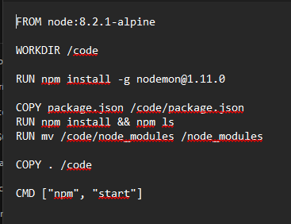
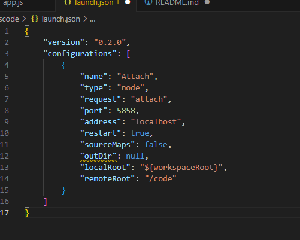
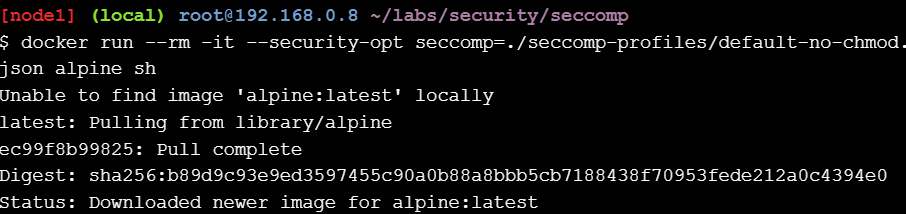
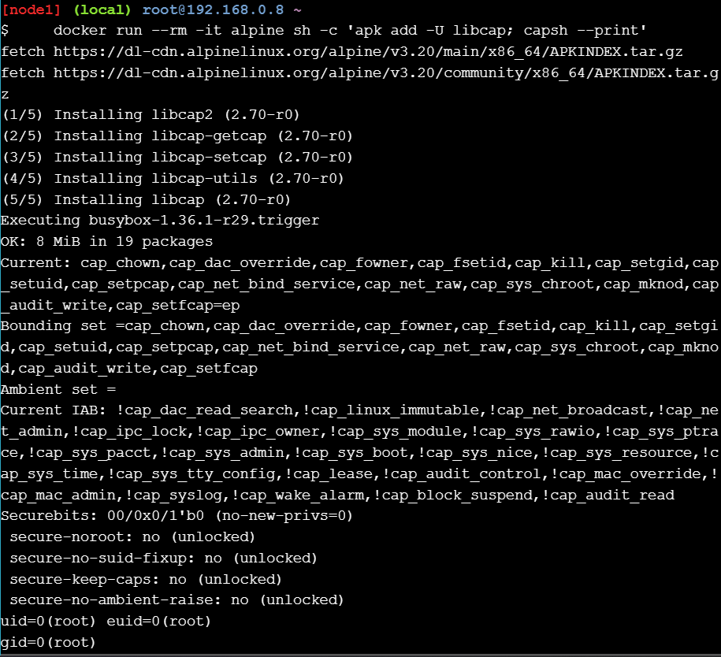

# ACTIVIDAD PLAY WITH DOCKER

## Docker for Developers Stage 2
## Stage 2: Digging Deeper

### Objetivos:

## 1 Desarrollo en contenedores: aprenda cómo integrar Docker en su IDE
Para esta parte lo hare utilizando vISUAL STUDIO:
Hemos creado una aplicación sencilla que incluye un error. Puede ver la aplicación en el directorio app/ de este repositorio. Puede clonar este repositorio o crear los archivos usted mismo. Asegúrese de que estén todos en el mismo directorio. Necesitará los siguientes archivos:

app.js define una aplicación de nodo simple. Sirve index.html y se actualiza cada 2 segundos con una cita de una matriz. Así es como se ve:

Echemos un vistazo al Dockerfile:

Como puede ver, instala nodemon, una utilidad que monitoreará cualquier cambio en su fuente y reiniciará automáticamente su servidor.

Iniciarás la aplicación con docker-compose.yml

Algunas cosas están sucediendo aquí:

- Define un servicio llamado "web", que utiliza la imagen creada a partir del Dockerfile en el directorio actual.
- Anula el comando especificado en Dockerfile para habilitar la función de depuración remota integrada en Node.js. Hacemos esto aquí porque cuando envía la imagen del contenedor de esta aplicación a producción, no desea que el depurador esté habilitado; es una anulación solo de desarrollo.
- Sobrescribe el código de la aplicación en el contenedor montando el directorio actual como un volumen. Esto significa que el código dentro del contenedor en ejecución se actualizará cada vez que actualice los archivos locales en su disco duro. Esto es muy útil, ya que significa que no tienes que reconstruir la imagen cada vez que realizas un cambio en la aplicación.
- Asigna el puerto 8000 dentro del contenedor al puerto 8000 en localhost, para que puedas visitar la aplicación.
- Finalmente, asigna el puerto 5858 dentro del contenedor al mismo puerto en localhost, para que pueda conectarse al depurador remoto.

### Ejecute la aplicación
Usando su terminal, navegue hasta el directorio con los archivos de la aplicación e inicie la aplicación
`docker-compose up`:

La aplicación ahora se está ejecutando. Abra http://localhost:8000/ para verlo en acción y tómese un momento para apreciar la poesía.

Sin duda es hermoso, pero el problema es obvio: generamos un mensaje en blanco al final antes de regresar a la primera línea. Es hora de depurar.

## Comenzar a depurar
Abra el directorio de la aplicación en VSCode. Dirígete al depurador haciendo clic en el ícono de error en la barra lateral izquierda.

Cree una configuración de depurador repetitiva haciendo clic en el ícono de ajustes y seleccionando "Node.js" en el menú desplegable.

Se creará y mostrará un archivo JSON. Reemplace su contenido con lo siguiente:

Hay tres cambios importantes aquí:

- Se eliminó toda la configuración de "Iniciar": estás usando Compose para iniciar la aplicación, no VSCode, por lo que es innecesario.
- reiniciar se establece en verdadero, de modo que el depurador se vuelva a conectar cuando se reinicie la aplicación.
- RemoteRoot está configurado en la ruta del directorio de códigos dentro del contenedor, porque es casi seguro que es diferente a la ruta del código en su máquina.

Con la configuración "Adjuntar" seleccionada, haga clic en el botón "reproducir" para iniciar el depurador.

Ahora regrese a app.js y busque la línea que dice lineIndex += 1 línea, justo después de inicializar la variable de mensaje. Establezca un punto de interrupción haciendo clic en el medianil, justo a la izquierda del número de línea.

Si la ventana de su navegador aún está abierta y actualizándose, en uno o dos segundos debería ver que llega al punto de interrupción. De lo contrario, regrese y actualícelo: VSCode volverá al frente tan pronto como el depurador lo acceda.

Presione el botón Reproducir en la parte superior para reanudar la ejecución del código. Llegará al punto de interrupción cada vez que se actualice el navegador, que es cada 2 segundos. Puede verlo recorrer las líneas y luego aparece el error: justo después de la última línea, el mensaje se establece como indefinido.

## Windows Containers Setup

Para los desarrolladores, Windows 10 es un excelente lugar para ejecutar contenedores Docker de Windows y se agregó compatibilidad con la contenedorización al kernel de Windows 10 con la Actualización de aniversario (tenga en cuenta que las imágenes de contenedores solo pueden basarse en Windows Server Core y Nanoserver, no en Windows 10). Lo único que falta es el Docker Engine nativo de Windows y algunas capas base de imágenes.

La forma más sencilla de obtener Windows Docker Engine es instalando la versión beta pública de Docker para Windows (enlace de descarga directa). Docker para Windows solía configurar solo un entorno de desarrollo Docker basado en Linux, pero la versión beta pública ahora configura entornos de desarrollo Docker para Linux y Windows, y estamos trabajando para mejorar el soporte de contenedores de Windows y la interoperabilidad de contenedores de Linux/Windows.

Con la versión beta pública instalada, el ícono de la bandeja de Docker para Windows tiene una opción para cambiar entre el desarrollo de contenedores de Linux y Windows.

Una vez descargado procedo con la instalacion de coker con las condifguraciones por defecto:

Ahora que has instalado Docker Desktop con éxito, hay que probar. Comienza ejecutando un
contenedor Docker simple directamente desde la línea de comando. Abre una ventana de
Terminal y ejecuta el siguiente comando:

 `docker --version`

 

Para ver si puedes ejecutar contenedores, ingresa el siguiente comando en la ventana de Terminal y presiona Enter:

`docker container run hello-world`

Visualizando en la aplicacion de Desktop:

Docker for IT Pros and System Administrators Stage 2

## Security
### Seccomp profiles
#### Step 1 - Clone the labs GitHub repo

Clona el repositorio de laboratorios con git clone https://github.com/docker/labs y navega al directorio labs/security/seccomp

git clone https://github.com/docker/labs

cd labs/security/seccomp

#### Step 2 - Test a seccomp profile

Ejecuta un contenedor con un perfil seccomp restringido usando docker run --rm -it --cap-add ALL --security-opt apparmor=unconfined --security-opt seccomp=seccomp-profiles/deny.json alpine sh.

docker run --rm -it --cap-add ALL --security-opt apparmor=unconfined --security-opt seccomp=seccomp-profiles/deny.json alpine sh

cat seccomp-profiles/deny.json

#### Step 3 - Run a container with no seccomp profile

Para ejecutar un contenedor sin ningún perfil seccomp, usa docker run --rm -it --security-opt seccomp=unconfined debian:jessie sh. Dentro del contenedor, ejecuta whoami y otros comandos para verificar los permisos.

docker run --rm -it --security-opt seccomp=unconfined debian:jessie sh

whoami

unshare --map-root-user --user
whoami

exit
exit

apk add --update strace
strace -c -f -S name whoami 2>&1 1>/dev/null | tail -n +3 | head -n -2 | awk '{print $(NF)}'

strace whoami

#### Step 4 - Selectively remove syscalls

Para ejecutar un contenedor con un perfil seccomp que deshabilita la llamada al sistema chmod, usa docker run --rm -it --security-opt seccomp=./seccomp-profiles/default-no-chmod.json alpine sh. Luego, intenta ejecutar chmod 777 / -v y observa que la operación falla debido a las restricciones del perfil.

docker run --rm -it --security-opt seccomp=./seccomp-profiles/default-no-chmod.json alpine sh

chmod 777 / -v

exit

docker run --rm -it --security-opt seccomp=./seccomp-profiles/default.json alpine sh

chmod 777 / -v

exit

cat ./seccomp-profiles/default.json | grep chmod

cat ./seccomp-profiles/default-no-chmod.json | grep chmod

#### Step 5 - Write a seccomp profile

Puedes analizar las llamadas al sistema usadas por un comando como ls usando strace -c -f -S name ls.

strace -c -f -S name ls 2>&1 1>/dev/null | tail -n +3 | head -n -2 | awk '{print $(NF)}'

#### Step 6 - A few Gotchas
### Linux Kernel Capabilities and Docker

#### Step 1 - Introduction to capabilities
#### Step 2 - Working with Docker and capabilities

#### Step 3 - Testing Docker capabilities

docker run --rm -it alpine chown nobody /

docker run --rm -it --cap-drop ALL --cap-add CHOWN alpine chown nobody /

docker run --rm -it --cap-drop CHOWN alpine chown nobody /

#### Step 4 - Extra for experts
docker run --rm -it alpine sh -c 'apk add -U libcap; capsh --print'

docker run --rm -it alpine sh -c 'apk add -U libcap;capsh --help'

## Networking
### Docker Networking Hands-on Lab
#### Section #1 - Networking Basics
**Step 1: The Docker Network Command**

Ejecuta docker network para ver los comandos disponibles relacionados con redes.

docker network

**Step 2: List networks**

Lista todas las redes con docker network ls.

docker network ls

**Step 3: Inspect a network**
Inspecciona la red bridge con docker network inspect bridge.

docker network inspect bridge

#### Step 4: List network driver plugins
docker info

#### Section #2 - Bridge Networking
**Step 1: The Basics**

Lista las redes disponibles con docker network ls, actualiza los paquetes de Alpine e instala bridge con apk update y apk add bridge. Luego, usa brctl show para ver las interfaces de red bridge y ip a para ver las direcciones IP.

docker network ls

apk update
apk add bridge

brctl show

ip a

**Step 2: Connect a container**

Ejecuta un contenedor Ubuntu en segundo plano con docker run -dt ubuntu sleep infinity y verifica los contenedores en ejecución con docker ps. Luego, usa brctl show y docker network inspect bridge para ver cómo el contenedor se conecta a la red bridge.

docker run -dt ubuntu sleep infinity

docker ps

brctl show

docker network inspect bridge

**Step 3: Test network connectivity**

Verifica los contenedores en ejecución con docker ps y prueba la conectividad a internet desde el contenedor con ping -c5 www.github.com.

docker ps

ping -c5 www.github.com

