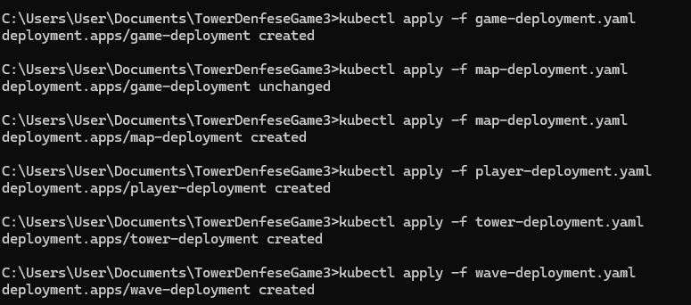

# Descripción del proyecto: V3
El juego "Tower Defense" es un videojuego de consola donde el jugador debe defender su base de
oleadas de enemigos colocando torres en lugares estratégicos del mapa. El proyecto incluirá el uso de
mocks, stubs y fakes para pruebas unitarias y de integración utilizando Mockito y pruebas de mutación.
Estructura del proyecto
Clases principales:
1. Microservicio de Juego (GameService): Maneja la lógica general del juego.
2. Microservicio de Mapa (MapService): Gestiona la representación y manipulación del mapa del juego.
3. Microservicio de Enemigos (EnemyService): Gestiona la creación y el comportamiento de los
enemigos.
4. Microservicio de Torres (TowerService): Gestiona la creación y el comportamiento de las torres.
5. Microservicio de Oleadas (WaveService): Maneja la lógica de las oleadas de enemigos.
6. Microservicio de Jugador (PlayerService): Representa al jugador y sus estadísticas.

## Paso a paso para completar el proyecto
1. Preparación del entorno:
• Instalar Docker, Docker Compose y Minikube (o un clúster Kubernetes equivalente).

2. Desarrollar los microservicios:
• Crear los archivos Java para cada microservicio (GameService, MapService, PlayerService,
TowerService, WaveService).

3. Configurar Docker:
• Crear un Dockerfile para cada microservicio.
• Construir las imágenes Docker usando el comando docker build.

Por ejemplo para el microservicio GameService, hice unos cambios respecto al dockerfile que nos paso:

- Cambié la versión de OpenJDK de la 11 a la 21.
- `COPY src/main/java/org/example /app `En el original, copiaba todo el contenido del directorio actual al directorio /app del contenedor. En el modificado, copie específicamente los archivos de src/main/java/org/example a /app. Esto hace que la estructura del directorio en el contenedor sea más específica.
- `RUN javac GameService.java MapService.java PlayerService.java TowerService.java WaveService.java`En el original, solo compilaba GameService.java. En el modificado, compilee varios archivos Java (GameService, MapService, PlayerService, TowerService, WaveService). Esto asegura que todas las clases necesarias estén compiladas, ya que antes lanzaba un error, puesto que una clase utiliza otras.
-`CMD ["java", "org.example.GameService"]` En el original, ejecutaba GameService sin especificar ningún paquete, lo que sugiere que el archivo no está en un paquete. En el modificado, ejecute org.example.GameService, asumiendo que el archivo compilado está en el paquete org.example.

El proceso es similar para todos los dockerfile:

4. Configurar Docker Compose:
• Crear un archivo docker-compose.yml para definir cómo los contenedores interactuarán entre
sí.
• Levantar los servicios definidos en Docker Compose usando `docker-compose up`.

 En el original, la construcción de la imagen Docker usa el directorio especificado directamente (./GameService). En el que he modificado, se especifica el contexto de construcción (.) y se define un Dockerfile específico (Dockerfile.gameservice). 
 
  En lugar de asumir un Dockerfile por defecto (Dockerfile), se especifica un Dockerfile para cada servicio. Esto es útil cuando tienes múltiples Dockerfiles en el mismo directorio raíz para diferentes servicios, ya que no use carpetas independientes para cada dockerfile.

5. Desplegar en Kubernetes:
• Crear archivos de despliegue (deployment.yaml) y servicio (service.yaml) para cada
microservicio.
• Aplicar las configuraciones de Kubernetes usando kubectl apply.

En este caso no hubo modificaciones y es similar para los demas:

Igualmente para los servicios:

Y los servicios similares para todas la clases:

6. Verificar despliegue:
• Usar comandos kubectl para verificar que los pods y servicios estén funcionando
correctamente (kubectl get pods, kubectl get services).

7. Implementar pruebas:
• Escribir pruebas unitarias e integración usando Mockito.
• Configurar y ejecutar pruebas de mutación para asegurar la robustez del código.

La prueba asegura que, cuando se llama al método placeTower en GameService:

- El método placeTower del MapService se invoca correctamente con los parámetros adecuados.
- Esto confirma que GameService interactúa correctamente con su dependencia MapService para colocar una torre en el mapa

